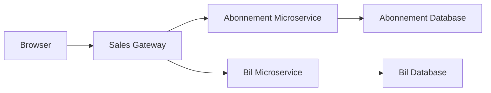

# Sales-gateway

## Overview
This API Gateway acts as an intermediary for various microservices, consolidating multiple endpoints into a unified interface. It is built using Flask and supports secure communication with the microservices for managing subscriptions, cars, and user authentication. 

The gateways is deployed on [Azure](https://sales-gateway-adcsa0dwahcxhkep.northeurope-01.azurewebsites.net/)

---

## Features
- Acts as a centralized API gateway for microservices:
  - Subscriptions
  - Cars
  - User Authentication
- Implements role-based access control (`sales` role required).
- Handles multiple HTTP methods (GET, POST, PATCH, DELETE).
- Includes Swagger documentation for API endpoints.
- Uses `.env` for configurable environment variables.
- Integrated health checks and error handling for unmatched routes.

---

## Architecture
### Diagram

    
The architecture follows a microservice pattern where the gateway forwards client requests to the appropriate microservices based on the defined endpoints.

- **Gateway**: Routes and manages requests.
- **Microservices**:
  - `Abonnement`: Handles subscription-related operations.
  - `Car`: Manages car-related operations.
  - `User`: Handles user authentication and session management.

---

## API Endpoints

### Base url

**Azure**

https://sales-gateway-adcsa0dwahcxhkep.northeurope-01.azurewebsites.net/docs

| **Endpoint**                | **Method** | **Description**                                      | **Request Body**                                                                 | **Response**                                                                                         | **Status Codes**           | **Authentication**      |
|-----------------------------|------------|------------------------------------------------------|----------------------------------------------------------------------------------|-----------------------------------------------------------------------------------------------------|----------------------------|-------------------------|
| `/`                         | GET        | Returns a summary of available endpoints             | None                                                                             | JSON with message and list of available endpoints                                                    | 200 OK                     | None                    |
| `/subscriptions`             | GET        | Fetches all subscriptions                           | None                                                                             | JSON array with subscription data                                                                   | 200 OK                     | Sales role required     |
| `/subscriptions/<id>`        | GET        | Fetches a specific subscription by ID                | None                                                                             | JSON object with subscription data                                                                   | 200 OK, 404 Not Found      | Sales role required     |
| `/subscriptions/<id>/car`    | GET        | Fetches car info related to a specific subscription  | None                                                                             | JSON object with car info                                                                            | 200 OK, 404 Not Found      | Sales role required     |
| `/subscriptions`             | POST       | Creates a new subscription                          | JSON object with subscription details                                            | JSON object with created subscription data                                                          | 201 Created                | Sales role required     |
| `/subscriptions/<id>`        | PATCH      | Updates a subscription by ID                        | JSON object with updated subscription details                                    | JSON object with updated subscription data                                                          | 200 OK, 404 Not Found      | Sales role required     |
| `/subscriptions/<id>`        | DELETE     | Deletes a subscription by ID                        | None                                                                             | JSON object with success message                                                                    | 200 OK, 404 Not Found      | Sales role required     |
| `/cars/available`            | GET        | Fetches all available cars                          | None                                                                             | JSON array with available cars                                                                      | 200 OK                     | Sales role required     |
| `/login`                     | POST       | Logs in a user to the service                       | JSON object with login credentials (email, password)                             | JSON object with user data and authorization token (cookie)                                          | 200 OK, 401 Unauthorized   | None                    |
| `/health`                    | GET        | Health check for the API                            | None                                                                             | JSON object with health status ({"status": "healthy"})                                               | 200 OK                     | None                    |
| `/subscriptions/<id>`        | GET        | Fetches a subscription by ID                        | None                                                                             | JSON object with subscription data                                                                   | 200 OK, 404 Not Found      | Sales role required     |

## Swagger documentation

Swagger UI for aggregated endpoints is available at https://sales-gateway-adcsa0dwahcxhkep.northeurope-01.azurewebsites.net/docs